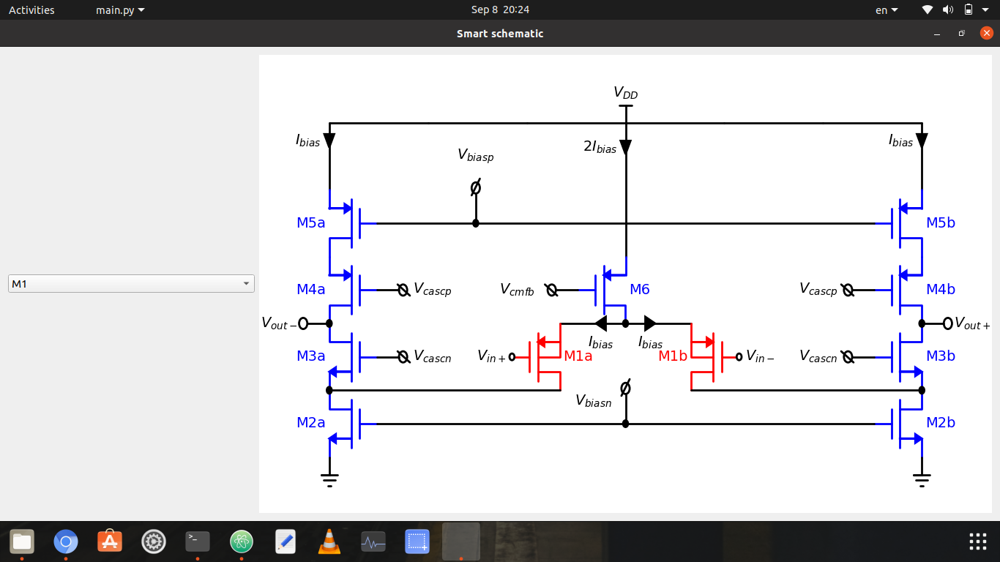

# Smart-Schematic
A Pyside2 GUI application that plots a schematic using schemdraw & matplotlib libraries.

## Getting started
### Prerequisites
- Python3
- Pyside2
- Schemdraw
- Matplotlib

### usage
please clone this repository first and run the following command   
`$ python3 main.py`  
a window will open like the following   
now, you can change the drop down list choice to notice color of your MosFet choice.
